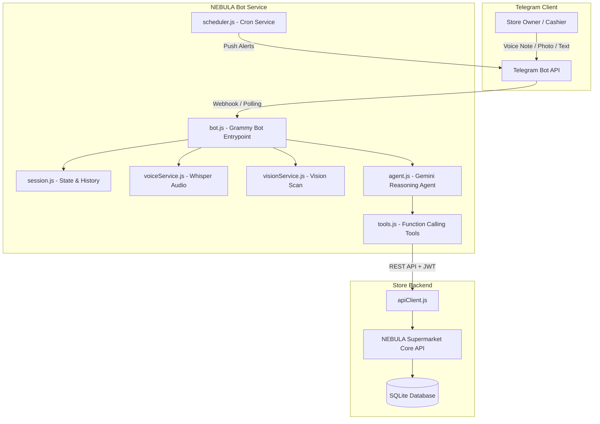

# NEBULA Supermarket — Telegram Operations AI Agent 🛒🤖

> **Autonomous Multilingual Store Operations Agent for Supermarket & Kirana Retailers**  
> Powered by Google Gemini 2.0 Flash, Grammy, Node.js, and Whisper Voice Processing.

[](https://nodejs.org/)
[](https://grammy.dev/)
[](https://ai.google.dev/)
[](LICENSE)

---

## 🌟 Overview

The **NEBULA Telegram Agent** is an autonomous conversational AI assistant designed specifically for retail store owners and billing staff. It connects directly to the **NEBULA Supermarket POS & Inventory Management System** backend, allowing operators to execute complete supermarket workflows through voice messages, photos, or text directly from their smartphone.

---

## 🚀 Key Capabilities

### 🗣️ Multilingual Voice & Audio Processing
- Send natural voice notes in **English, Hindi, Tamil, Hinglish, or Tanglish**.
- Real-time audio transcription powered by **OpenAI Whisper** and **Google Gemini Multimodal Audio**.
- Conversational billing commands (e.g., *"Bill 2 packets of milk and 1kg sugar for Ramesh on Khata"*).

### 📸 Computer Vision & Barcode Scanning
- Snap photos of product packaging, shelf labels, or barcodes.
- Automatic product identification, SKU lookup, and stock intake suggestions.

### ⚡ Complete Store Operations via Chat
- **Billing & POS**: Create draft sales, apply GST slabs (0%, 5%, 12%, 18%, 28%), and finalize bills atomically.
- **WhatsApp Invoices**: Auto-dispatch digital PDF receipts directly to customer WhatsApp numbers.
- **Customer Khata (Credit Ledger)**: Query dues, record cash/UPI payments, and send repayment reminders.
- **Inventory & Stock Intake**: Receive batches, verify expiry dates, check reorder thresholds, and prevent below-cost sales.
- **Daily Close (EOD)**: Instant cash reconciliation, digital payment verification, and gross tax summaries.
- **Executive Pitch Decks**: Generate downloadable PowerPoint presentations (`.pptx`) with charts on demand.

### ⏰ Proactive Cron Alerts
- **Morning Briefing (08:30 AM)**: Summary of stock reorder requirements and pending Khata dues.
- **Low-Stock Trigger (15:00 PM)**: Immediate notifications when fast-moving items cross safety thresholds.
- **Nightly Daily Close (21:30 PM)**: Total counter collections, tax splits, and cash-in-drawer tally.

---

## 🏗️ Architecture



---

## 🛠️ Quickstart & Installation

### 1. Prerequisites
- **Node.js**: v18.0.0 or higher
- **Telegram Account**: To create your bot via `@BotFather`
- **NEBULA POS Server**: Running locally or deployed (default `http://localhost:5000/api`)
- **LLM API Key**: Google Gemini (`GEMINI_API_KEY`), Anthropic, or OpenAI

### 2. Clone the Repository
```bash
git clone https://github.com/gunavathi16/nebula-telegram-bot.git
cd nebula-telegram-bot
```

### 3. Install Dependencies
```bash
npm install
```

### 4. Configure Environment Variables
Copy the sample environment file:
```bash
cp .env.example .env
```

Edit `.env` with your credentials:
```env
# Telegram Bot Token from @BotFather
TELEGRAM_BOT_TOKEN=123456789:ABCdefGHIjklMNOpqrSTUvwxYZ

# Backend REST API endpoint
API_BASE_URL=http://localhost:5000/api

# LLM Provider (anthropic | openai | google)
LLM_PROVIDER=google
GEMINI_API_KEY=AIzaSyYourGeminiApiKeyHere

# Server & Webhook Configuration
PORT=3001
# Set for production webhook (leave empty for local long-polling)
WEBHOOK_URL=
WEBHOOK_PATH=/webhook
```

### 5. Obtain Telegram Bot Token
1. Open Telegram and message **[@BotFather](https://t.me/BotFather)**.
2. Send `/newbot` and follow the prompts to name your bot.
3. Copy the HTTP API token into `TELEGRAM_BOT_TOKEN` in `.env`.

---

## 💻 Running the Bot

### Local Development (Long Polling Mode)
```bash
npm run dev
```

### Production Start
```bash
npm start
```

### Run Test Suite
```bash
npm test
```

---

## 📱 Telegram Commands Reference

| Command | Description | Permission |
| :--- | :--- | :--- |
| `/start` | Welcome greeting, language selection, and operator authentication | All |
| `/help` | Complete cheat sheet of commands, voice examples, and tools | All |
| `/status` | Real-time POS server connectivity and active store profile | All |
| `/close` | Fetch instant Daily Close summary for today's counter sales | Owner |
| `/lowstock`| List products currently below their reorder threshold | All |
| `/dues` | View top customer credit dues and total outstanding Khata | Owner |
| `/deck` | Generate and download an executive 7-day PPTX presentation deck | Owner |

---

## 🧠 Autonomous AI Function Tools

The Gemini agent is equipped with native function tools defined in `tools.js`:

| Tool | Purpose |
| :--- | :--- |
| `search_products` | Search inventory by product name, SKU, or category |
| `check_stock` | Inspect exact shelf quantity and reorder levels |
| `create_sale` | Process multi-item bill with GST tax computation |
| `get_customer_balance`| Look up customer Khata ledger and dues |
| `record_khata_payment`| Record customer repayment towards their outstanding credit |
| `receive_inventory` | Record incoming vendor shipments and batch numbers |
| `get_daily_close` | Produce daily sales, payment breakdown (UPI/Cash/Card), and tax split |
| `get_invoice_pdf` | Generate high-resolution PDF tax invoice buffer |
| `get_analysis_deck` | Build formatted presentation slides (`.pptx`) with metrics |

---

## 📄 License

This project is licensed under the MIT License — see the [LICENSE](LICENSE) file for details.

---

Made with ❤️ for Indian Kirana & Modern Supermarket Retailers.
